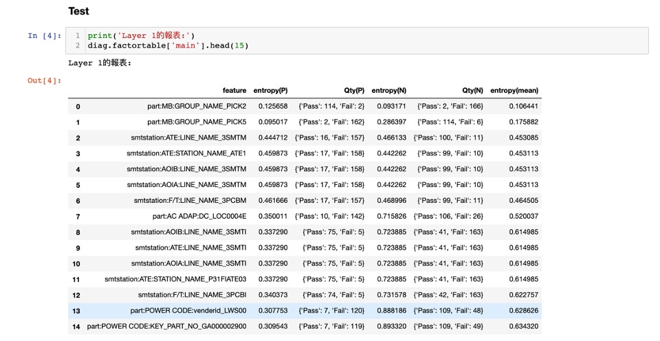

# KeyFactors
良率朔源-集中性分析

- History:
  - 8/13
    - 對應MBSN的時候考慮維修的狀況
    - 組part的時候考慮維修的狀況
  - 8/14
    - parse vendorcode, DC
  - 8/17
    - 撿料: 同一筆測試可能有兩筆{Part}維修紀錄, 保留測試後的第一筆
    - 過站: 同一筆測試可能有兩筆{station}過站紀錄, 保留測試前的最後一筆
  - 8/18
    - remove missing values > 30% feature
    - remove single unique feature
  - 8/19 
    - class
    - 修改檔名(英文小寫)
    - 刪除不需要的sheet

- TODO:
  1. 需要請IT統一提供資料的時間格式, 不能放在程式裡處理
  2. 需要請IT統一提供資料的欄位, 檔案命名格式, 檔案格式從xlsx改為csv
  3. 時間區段的集中性分析
  4. data路徑以後要改成存放data的絕對路徑
  
  
- Sample Code

```python
#init
diag = Diag()
#load Data
diag._load_mesdata()
#組大表
diag.getbigtable()
#集中性
diag.rankfactor()
#output excel
diag.output_bigtable()
diag.output_factorranktable()
```


